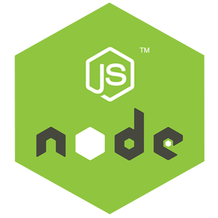

 

     
    

  
##  Amazon Web Services

  

 

Repositorio central para proyectos que implementan tecnologías de Amazon Web Services (AWS).

 

* Lenguajes: Javascript, Typescript, otros.
* Frameworks: Serverless, otros.
* Servicios AWS: Lambda, S3, SQS, SNS, RDS, Api Gateway, DynamoDB, otros.
* Tecnologías: Nodejs, otras.
* ORM: Sequelize, TypeORM, otros.
* Bases de datos: MySQL, DynamoDB, otras.
* Bibliotecas: dotenv, cors, aws-sdk-v3, nodemon, otras.
* Herramientas: Vsc, Postman, Git, otros.
* Testing : Jest, Supertest, Mocha & Chai, otros.

  
 
  

<!------Start Index----->

## Índice 📜

 
 Ver 

  

#### 🗂️ Proyectos
* [Microservicio para gestión de usuarios de mercado libre ](#microservicio-para-la-gestión-de-usuarios-de-mercado-libre--) 

  

    
    
    
    
    
    
  

  
* [Api Rest para la gestión estadística de la producción y venta de bioetanol ](#api-rest-para-el-manejo-estadístico-de-producción-y-ventas-de-bioetanol-implementado-con-serverless-framework-api-gateway-nodejs-dynamodb-systems-manager-parameter-store-lambda-otros-) 

  

    
    
    
    
    
  

  
* [Sistema de respaldo para planta minera](#sistema-de-respaldo-para-registros-de-plantas-mineras-implementado-con-sqs-sns-typescript-s3-dynamodb-api-gateway-cloudwatch-systems-manager-parameter-store-serverless-framework-lambda-otros-) 

   

    
    
    
    
    
    
  

  
* [Modelo CRUD para la gestión de objetos imagenes S3 ](#modelo-crud-para-la-gestión-de-objetos-imagenes-s3--)

  

    
    
    
    
    
  

  
* [Modelo CRUD para gestionar Pagos con MercadoPago](#modelo-crud-para-gestionar-pagos-con-mercadopago-) 

  

    
    
    
    
    
  

  
* [Microservicio OpenWeather](#microservicio-openweather-) 

   

    
    
    
    
  

  
* [Servicio SQS de comunicación Lambdas ](#servicio-sqs-de-comunicación-lambdas-)

  

    
    
    
    
  

  
* [Servicio SNS de comunicación Lambdas](#servicio-sns-de-comunicación-lambdas-) 

  

    
    
    
  

 

#### 📚 Tutoriales Serverless de AWS
* [Crear e implementar una función lambda con serverless en AWS](#crear-e-implementar-una-función-lambda-con-serverless-en-aws-) 

  

    
    
  

  
* [Crear e implementar una función lambda con serverless, Api gateway y nodejs en AWS](#crear-e-implementar-una-función-lambda-con-serverless-api-gateway-y-nodejs-en-aws-) 

  

    
    
    
  

 

#### 💻 Tutoriales de la consola de AWS
* [Crear una función lambda con Nodejs de AWS](#crear-una-función-lambda-con-nodejs-de-aws-) 

  

    
    
  

  
* [Crear una función lambda con Nodejs y Api Gateway de AWS](#crear-una-función-lambda-con-nodejs-y-api-gateway-de-aws-) 

   

    
    
    
  

  
 

<!------Stop Index----->
  
  
 
  

 <!------MICROSERVICIO USUARIOS ML AWS------>
 

  
 ### Microservicio para la gestión de usuarios de Mercado Libre.  [🔝](#índice-)
 
  

  

  
  
  
  
  
  
  
  
  
  
  

 

 ### Detalles

  
  

<!------FIN MICROSERVICIO USUARIOS ML AWS------>

  
 
 
 
 
 
 

 <!------START API_BIOETANOL_DYNAMO------>
 

  
 ### Api Rest para el manejo estadístico de producción y ventas de bioetanol  [🔝](#índice-)
 
  

  
  
  
  
  
  
  
  
  
  

 

 ### Detalles

  
  

  
<!------END API_BIOETANOL_DYNAMO------>

 
 
 
 
 
 

 <!------BackupSystem_SQS_SNS_S3_DynamoDB_AWS ------>
 

  
 ### Sistema de respaldo para planta minera. [🔝](#índice-)
 
  

  

  
  
  
  
  
  
  
  
  
  
  

 

 

 ### Detalles

  
  

  
<!------FIN BackupSystem_SQS_SNS_S3_DynamoDB_AWS ------>

  
 
 
 
 
 
 
  
  
<!------CRUD Amazon S3 AWS------>
  

  
 ### Modelo CRUD para la gestión de objetos imagenes S3  [🔝](#índice-)
 
   

  

  
  
  
  
  
  
  
  

 

 ### Detalles

  
  

  
<!------FIN CRUD Amazon S3 AWS------>
  
 
 
 
 
 
 
  
<!------CRUD Amazon DynamoDB AWS------>
  

  
 ### Modelo CRUD para gestionar Pagos con MercadoPago. [🔝](#índice-)
 
  

  
  
  
  
  
  
  
  
   

 

 ### Detalles

  
  

  
<!------FIN CRUD Amazon DynamoDB AWS------>

 
 
 
 
 
 
  
<!------Microservice OpenWeather Nodejs Jest ------>
  

### Microservicio OpenWeather. [🔝](#índice-)
    
   

    

  
  
  
  
  
  
  
  

 

 ### Detalles

  
  

  
<!------FIN Microservice OpenWeather Nodejs Jest ------>

 
 
 
 
 
 
  
  
<!------Producer_Consumer_SQS_FIFO_AWS------>
  

 ### Servicio SQS de comunicación Lambdas.  [🔝](#índice-)
 
 

  
  
  
  
  
  
  
  

 

 ### Detalles

  
  

<!------FIN Producer_Consumer_SQS_FIFO_AWS------>

 
 
 
 
 
 
  
  
<!------ CRUD_SNS_NodeJS_AWS------>
  

 ###  Servicio SNS de comunicación Lambdas. [🔝](#índice-)
 
   

  
  
  
  
  
  
  
  

 

 ### Detalles

  
  

  
<!------FIN  CRUD_SNS_NodeJS_AWS------>

 
 
 
 
 
 
  

    
## AWS Serverless Tutoriales

<!------ Lambda_Serverless_AWS_Example------>
  

### Crear e implementar una función lambda con serverless en AWS. [🔝](#índice-)
    
   

  
  
  
  
  
  

 

 ### Detalles

  
  

<!------FIN  Lambda_Serverless_AWS_Example------>

 
 
 

<!------ Lambda_Api_Gateway_Serverless_AWS_Example------>
  

### Crear e implementar una función lambda con serverless, Api gateway y nodejs en AWS. [🔝](#índice-)
    
   

  
  
  
  
  
  
  

 

 ### Detalles

  
  

<!------FIN  Lambda_Api_Gateway_Serverless_AWS_Example------>

 
 
 
 
 
 
 
 
 
  
  

    
## AWS Console Tutoriales

### Crear una función lambda con Nodejs de AWS. [🔝](#índice-)

  

 

### Crear una función lambda con Nodejs y Api Gateway de AWS. [🔝](#índice-)

  

 

  
